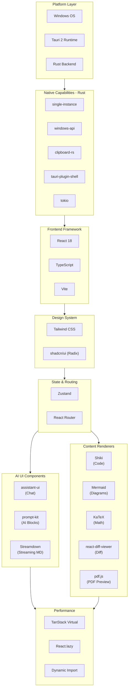
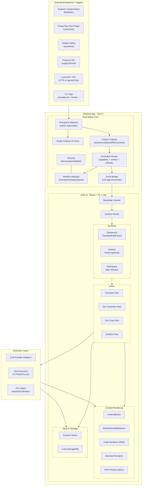
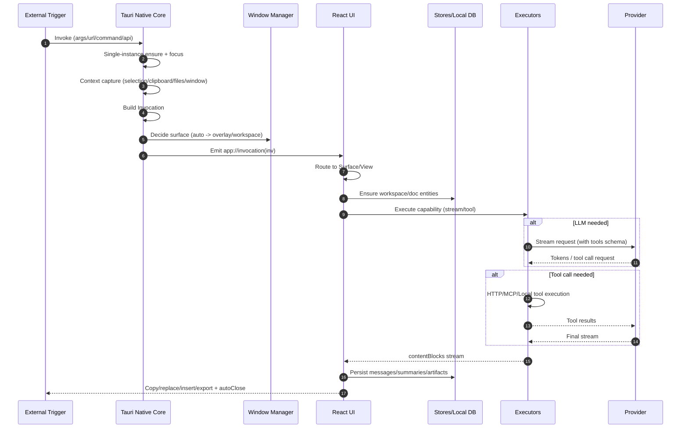
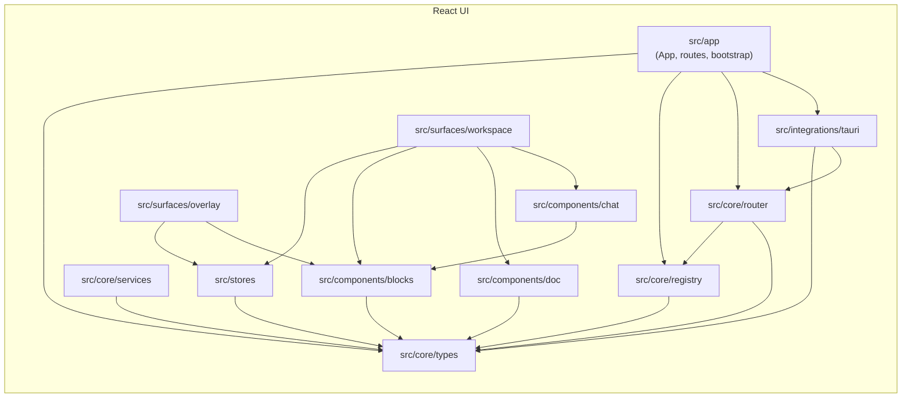

# Windows 桌面“随处可调用能力”客户端——技术方案（Tauri + React）

> 目标：将 **意图 → 结果** 的路径压缩到 “一次触发 + 最少交互”，尽量避免复制/粘贴与应用切换；支持短任务“用之即走”和长任务“多轮对话/工作台”。

---

## 2. 需求摘要与设计原则

### 2.1 核心场景
- **选中文本** → 一键翻译/改写（无需打开翻译网站/程序，无需手动复制）
- **选中文件**（PDF/DOCX/MD/TXT…）→ 一键总结（文档列表、概要、要点、引用定位）
- **PowerToys Run/脚本/协议唤醒** → 打开对话界面进行多轮对话（围绕统一文档集合）

### 2.2 关键目标
- **能力可在任意位置触发**（入口多样但统一协议）
- **上下文自动带入**（选区/剪贴板/文件/窗口信息等）
- **界面按任务而变**（Chat UI 只是多轮对话的一种 surface；翻译/总结使用专用 UI）
- **短任务极快**（Overlay/Modal/Toast，用完即走；支持一键升级到工作台）
- **易扩展**（能力注册式、视图注册式、渲染器注册式）

### 2.3 非目标（边界）
- 不自研 PowerToys Run 类启动器（只适配其插件或通过 IPC 被调用）
- 不依赖 Dify/LangChain 这类重平台框架作为核心（可通过 MCP/HTTP 工具调用对接）
- 第一阶段不追求对所有 Windows 应用“精准读选区”（通用方案优先：剪贴板策略）

---

## 3. 总体架构（Core + Surfaces）

### 3.1 两层结构
- **Native Core（Rust / Tauri）**
  - 单实例/聚焦、入口适配（Args/Protocol/IPC/Hotkey）、上下文捕获、窗口管理、安全、事件桥接
- **Web UI（React / TS / Vite）**
  - Surface 路由、Views（翻译/总结/对话/生成物）、内容渲染、状态与存储

### 3.2 UI Surface 分层
- **Ephemeral（用之即走）**：Overlay / Small Modal / Toast / No UI  
  适合：翻译、润色、改写、快速问一句  
- **Session（中等时长，可选）**：Panel / Medium Window  
  适合：围绕一组文档短时对话与小产出  
- **Workspace（长驻工作台）**：Main Window  
  适合：文档列表/概要要点/引用定位/多轮对话/生成物管理

> 原则：默认优先使用 Ephemeral（更少打断），必要时一键“Open in Workspace / 打开详情”升级到 Workspace。

---

## 4. 统一能力模型：Capability / Invocation / contentBlocks

### 3.1 Capability（能力定义）
能力是第一公民，描述“做什么”，与“在哪里触发/怎么展示”解耦。

关键字段：
- `id/name/description/tags`
- `contextRequires`：所需上下文（selectedText、filePaths…）
- `defaultUiMode`：推荐界面形态（overlay/workspace/none/auto）
- `argsSchema`：结构化参数（可选 JSON Schema）
- `allowPromoteToWorkspace`：轻界面是否可升级到工作台

### 3.2 Invocation（统一调用对象）
所有入口（右键/热键/协议/PowerToys/IPC）最终归一为：

```json
{
  "id": "uuid",
  "capabilityId": "translate.selection",
  "args": { "targetLang": "en", "tone": "formal" },
  "context": {
    "selectedText": "...",
    "clipboardText": "...",
    "filePaths": ["C:\\a.pdf"],
    "activeWindow": { "title": "...", "processName": "..." },
    "cursor": { "x": 120, "y": 300 }
  },
  "source": "context_menu | powertoys | hotkey | protocol | api",
  "ui": { "mode": "auto | overlay | workspace | none", "focus": true }
}
```

### 3.3 contentBlocks（结构化内容渲染）
不把所有输出塞进 Markdown 字符串；统一用块结构渲染：
- `markdown` / `code` / `mermaid` / `math`
- `diff`（替换/改写确认）
- `citations`（引用卡片：docId + 位置 + snippet）
- `artifact`（生成物：报告/表格/计划等）

好处：
- Chat、总结、翻译可复用同一套渲染器
- 新增输出类型不会污染所有页面逻辑
- Overlay 可只加载轻渲染，Workspace 再加载 pdf.js 等重模块

---

## 4. UI 技术选型与整合库（轻量 + 易扩展）

### 4.1 核心栈（推荐）
- **壳**：Tauri 2（非 Electron；多窗口；系统集成）
- **UI**：React 18 + TypeScript + Vite
- **设计系统**：Tailwind + shadcn/ui（Radix 底座）

理由（与需求强绑定）：
- 多 Surface 工作台 + 富渲染 + 可插拔 Views/Renderers：React 生态成熟、资料最多、实现成本最低  
- shadcn/ui “源码进仓库”，适合做高度个性化的翻译/总结界面  
- Vite + lazy load 容易把“用之即走”窗口做轻快  
- Tauri 将单实例/协议/IPC/窗口置顶等系统能力隔离在 Rust 层，UI 专注展示

### 4.2 UI 侧可集成库（按职责分离）
- **Chat Surface（多轮对话）**：assistant-ui（仅用于 DocChatView）
- **AI UI 积木（非 Chat）**：prompt-kit（按需摘取/复制）
- **流式 Markdown 稳定渲染**：Streamdown（或 react-markdown + 插件链）
- **长列表性能**：TanStack Virtual
- **PDF 预览**：pdf.js（Workspace 才加载）
- **Diff**：react-diff-viewer（或等价替代）
- **代码渲染**：Shiki
- **图表**：Mermaid（code fence renderer）
- **公式**：KaTeX（可选）

使用原则：
- assistant-ui **只做 chat**；翻译/总结/生成物不强行走 chat 范式  
- prompt-kit **只取需要的块**，避免全量依赖带来样式/体积问题  
- shadcn/ui 作为统一基础组件底座，保证交互一致性

---

## 5. Windows 系统入口与上下文捕获（不做 launcher，但随处可用）

### 5.1 入口适配器（Adapters）
- Explorer 右键菜单（对文件/目录）
- PowerToys Run 插件（将命令解析为 Invocation，经 IPC 发给本应用）
- 全局快捷键（任意处唤醒 overlay 或打开 workspace 指定 view）
- 协议唤醒（`myapp://invoke?...`）
- 本地 IPC（HTTP 127.0.0.1 或 Named Pipe；用于脚本/其它应用调用）

### 5.2 上下文捕获策略（MVP 优先通用）
- **选中文本**：优先尝试读取 selection；拿不到时采用通用方案：  
  `Ctrl+C → 读剪贴板 → 恢复剪贴板`（尽量无感）  
- **文件路径**：右键菜单参数直接获取  
- **活动窗口信息**：标题/进程名，用于提示与日志  
- **光标位置**：overlay 定位

---

## 6. 安全与治理（本地 IPC 必须考虑）
- IPC 鉴权：首次运行生成 token，存用户目录；请求需携带 token
- 仅监听本机回环地址 `127.0.0.1`；必要时限制 Origin
- Markdown 渲染启用 sanitize，避免 XSS
- Invocation 日志（来源、能力、耗时、错误），便于诊断

---

## 7. 目录结构（可直接开仓库）

```
repo/
├─ src-tauri/
│  ├─ src/
│  │  ├─ main.rs                  # 单实例/入口/事件桥接
│  │  ├─ windows.rs               # overlay/workspace 窗口管理
│  │  ├─ context.rs               # 上下文捕获（剪贴板/活动窗口）
│  │  ├─ invoke.rs                # 统一 Invocation 处理并 emit
│  │  └─ local_api.rs             # 可选 IPC：HTTP/pipe
│  └─ tauri.conf.json
│
├─ src/
│  ├─ app/
│  │  ├─ App.tsx
│  │  ├─ routes.tsx
│  │  └─ bootstrap.ts             # 监听 app://invocation
│  ├─ core/
│  │  ├─ types/                   # Invocation/Capability/Blocks/Workspace
│  │  ├─ registry/                # capability/view/renderer registry
│  │  ├─ router/                  # Invocation -> Surface
│  │  └─ services/                # llmClient/docIngest/storage
│  ├─ stores/                     # Zustand
│  ├─ surfaces/
│  │  ├─ overlay/                 # Ephemeral
│  │  └─ workspace/               # Long-lived
│  ├─ components/
│  │  ├─ blocks/                  # contentBlocks renderers
│  │  ├─ doc/
│  │  └─ chat/
│  └─ integrations/tauri/         # events/invoke/window wrappers
└─ vite.config.ts
```

---

## 8. TS 核心接口（节选）

> 说明：以下为关键类型摘要，完整定义建议放置于 `src/core/types/*`。

### 8.1 Invocation / Context
```ts
export type UiMode = "auto" | "overlay" | "workspace" | "panel" | "none";

export type InvocationContext = {
  selectedText?: string;
  clipboardText?: string;
  filePaths?: string[];
  activeWindow?: { title?: string; processName?: string; processId?: number };
  cursor?: { x: number; y: number };
  url?: string;
  extra?: Record<string, unknown>;
};

export type Invocation = {
  id: string;
  capabilityId: string;
  args?: Record<string, unknown>;
  context?: InvocationContext;
  source: "context_menu" | "powertoys" | "hotkey" | "protocol" | "api" | "internal";
  ui?: { mode?: UiMode; focus?: boolean; position?: "cursor" | "center" | "last"; autoClose?: boolean };
  createdAt: number;
};
```

### 8.2 contentBlocks
```ts
export type ContentBlock =
  | { type: "markdown"; markdown: string }
  | { type: "code"; language?: string; code: string }
  | { type: "mermaid"; code: string }
  | { type: "diff"; before: string; after: string; format?: "unified" | "split" }
  | { type: "citations"; citations: { docId: string; snippet?: string; location?: any }[] }
  | { type: "artifact"; artifactId: string; title: string; kind: string; content: string };
```

---

## 9. 整体架构图（Mermaid）

### 9.1 技术栈层次图


### 9.2 模块架构图


### 9.3 端到端时序图


### 9.4 UI 包/模块依赖图（工程化补全）


---

## 10. MVP（3 个迭代建议）

### Iteration 1：顺滑闭环（立刻感知价值）
- `translate.selection`：Overlay 翻译（复制/替换/插入，自动关闭）
- 入口：全局快捷键 + 协议/命令行
- 上下文：剪贴板策略 + 活动窗口信息
- 渲染：markdown + code（流式）

### Iteration 2：文档总结工作台成立
- `summarize.file`：Workspace（文档列表 + 概要/要点）
- PDF 预览（pdf.js）延迟加载
- 导出：复制 markdown / 保存文件

### Iteration 3：文档对话 + 生成物
- `chat.workspace`：DocChatView（assistant-ui）
- `artifact.from_chat`：固化生成物（版本/导出）
- IPC：Local API/pipe（给 PowerToys 插件/脚本调用）

---

## 11. 结论
本方案以 **Invocation 统一协议** + **Capability 注册式扩展** + **Surfaces 分层** 为核心，使“短任务用之即走、长任务多轮对话、工作台文档管理”能够在一个 Tauri 桌面客户端中顺滑共存，并且 UI 侧保持轻量与可扩展。

